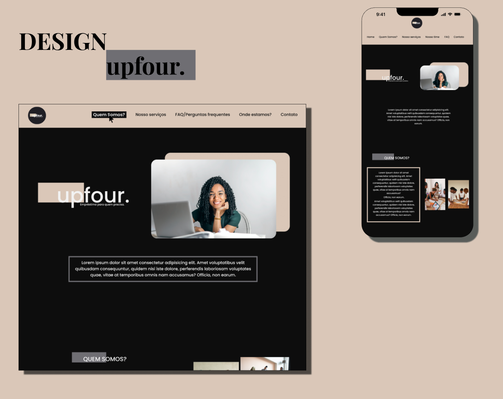

# Landing Page upfour.

# Sumário
<!--ts-->
   * [Prévia do Design](#previa-do-design)
   * [Sobre](#Sobre)
   * [Etapa de Construção](#etapa-de-construção)
   * [Tecnologias](#tecnologias)
   * [Hospedagem](#hospedagem)
   * [Licença](#licença)

<!--te-->

# Prévia do Design

Link para
[Figma](https://www.figma.com/file/65dlz2DhUriWut9usaeHGE/Projeto-Landing-Page---Upfour?node-id=45%3A108&t=gY91RIABDafnr29e-1)

# Sobre

//Textooo

# Etapa de Construção

- [x]  Wiframe: planejamento-estrutural
- [x]  Estrutura básica: estrutura
- [x]  Design: planejamento-design
- [x]  Estilização:  estilização
- [x]  Refatoração: refatoração
- [x]  Responsividade: planejamento-responsividadde 
- [x]  Responsividade: estrutura-responsiva (mobile-first)
- [x]  Funcionalidade: DOM

[Projects do Github - Landing Page](https://github.com/users/MiaAntunes/projects/4/views/2)

# Tecnologias

# Hospedagem

link!!!!

# Licença

